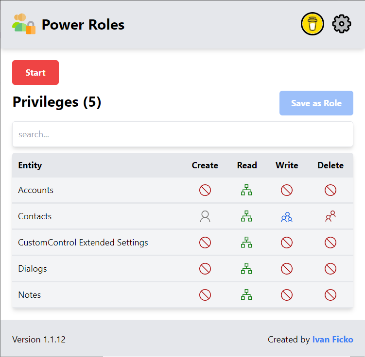

# Power Roles Extension

## Overview

Power Roles is an Edge extension that helps administrators manage user roles more effectively within the Dynamics 365 Model-Driven App. This tool allows you to record user actions and then displays the necessary privileges needed to perform those actions. You can save the identified privileges as a new role or update an existing one, streamlining the role management process.

## Features

- **Record User Actions:** Seamlessly track and record actions performed by users within the Dynamics 365 Model-Driven App.
- **Analyze Privileges:** Automatically analyze recorded actions to determine the required privileges.
- **Manage Roles:** Save the identified privileges as a new security role or update an existing role in Dynamics 365.
- **User-Friendly Interface:** Simple and intuitive interface for easy navigation and management.

## Screenshot

## Installation

 [Edge Add-ons Store](https://microsoftedge.microsoft.com/addons/detail/power-roles/hbjkmplgempdbiffddnneofdfedmmbpo)
 
 [Chrome Add-ons Store](https://chromewebstore.google.com/detail/power-roles/gmdlnpamnbnadajemnoacbnfmfilnkai)

## Usage

1. **Open Dynamics 365 Model-Driven App:**
   
   - Navigate to your Dynamics 365 environment.

2. **Start Recording:**
   
   - Click on the extension icon in the Edge toolbar to start recording user actions.

3. **Perform Actions:**
   
   - Carry out the actions you want to record within the Dynamics 365 app.

4. **Stop Recording:**
   
   - Click on the extension icon again to stop recording.

5. **View Privileges:**
   
   - The extension will display the necessary privileges required for the recorded actions.

6. **Save or Update Role:**
   
   - Choose to save the privileges as a new role or update an existing role in Dynamics 365.

## Contributing

Contributions are welcome! Please fork this repository and submit pull requests for any enhancements, bug fixes, or new features.

1. Fork the repository.
2. Create a new branch: `git checkout -b feature/YourFeature`.
3. Make your changes and commit them: `git commit -m 'Add some feature'`.
4. Push to the branch: `git push origin feature/YourFeature`.
5. Open a pull request.

## License

This project is licensed under the MIT License - see the [LICENSE](LICENSE) file for details.

## Contact

If you have any questions, issues, or feature requests, please open an issue on GitHub or contact [ivan.ficko@outlook.com](mailto:ivan.ficko@outlook.com).

---

Made with ❤️ by Ivan Ficko
