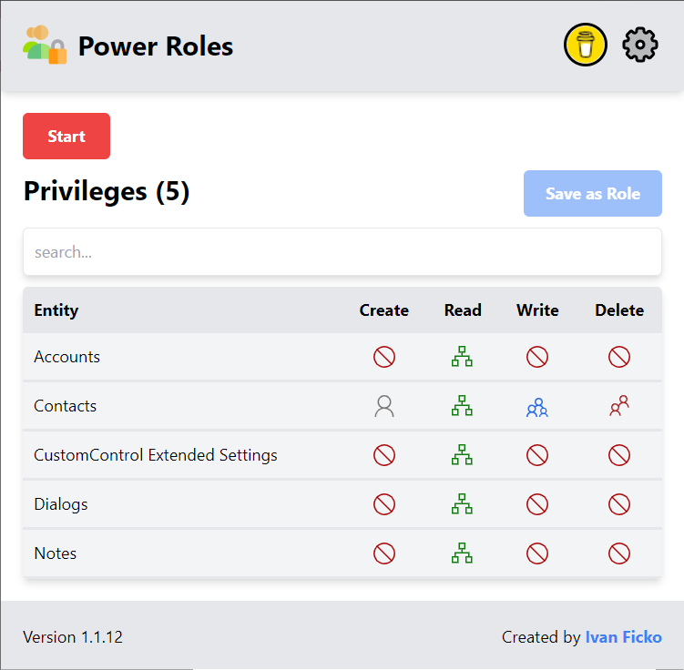

# Power Roles Extension

## Overview

Power Roles is an Edge extension that helps administrators manage user roles more effectively within the Dynamics 365 Model-Driven App. This tool allows you to record user actions and then displays the necessary privileges needed to perform those actions. You can save the identified privileges as a new role or update an existing one, streamlining the role management process.

## Features

- **Record User Actions:** Seamlessly track and record actions performed by users within the Dynamics 365 Model-Driven App.
- **Analyze Privileges:** Automatically analyze recorded actions to determine the required privileges.
- **Manage Roles:** Save the identified privileges as a new security role or update an existing role in Dynamics 365.
- **User-Friendly Interface:** Simple and intuitive interface for easy navigation and management.

## Screenshot

## Installation

 [Edge Add-ons Store](https://microsoftedge.microsoft.com/addons/detail/power-roles/hbjkmplgempdbiffddnneofdfedmmbpo)
 
 [Chrome Add-ons Store](https://chromewebstore.google.com/detail/power-roles/gmdlnpamnbnadajemnoacbnfmfilnkai)

## Usage

1. **Open Dynamics 365 Model-Driven App:**
   
   - Navigate to your Dynamics 365 environment.

2. **Open the extension:**

   - Click the Power Roles icon in the Edge/Chrome toolbar to open the popup.

3. **Start Recording:**

   - Click the **Start** button in the popup. A red `REC` badge appears on the extension icon.

4. **Perform Actions:**

   - Carry out the actions you want to record within the Dynamics 365 app.

5. **Stop Recording:**

   - Open the popup again and click **Stop**.

6. **View Privileges:**

   - The popup displays the privileges required for the recorded actions. Click a row, column header, or individual cell to cycle the privilege depth (None → User → Business Unit → Parent/Child → Organization).

7. **Save or Update Role:**

   - Click **Save as Role** to create a new role (optionally adding it to a solution) or update an existing role in Dynamics 365.

## Known Limitations

- **Create / Read / Write / Delete are limited to user-owned tables** to keep recordings clean (system-table reads during form loads are ignored). Append / Append To / Assign can target any referenced table, including system tables such as `systemuser` and organization-owned tables.
- **Append / Append To are best-effort.** They are detected from lookups set inline on create/update (`...@odata.bind` in the body) and from explicit associations (`$ref` requests), including operations inside a `$batch`. The record carrying the lookup gets **Append** and the referenced record gets **Append To**. Deeply nested (deep-insert) binds may not be picked up — review before saving.
- **Assign is detected from the owner lookup.** Setting `ownerid` on create/update records **Assign** on that record (owner assignment is governed by Assign, not Append To). **Share** is not detected.
- **Method-to-privilege mapping is heuristic.** `GET`→Read, `POST`→Create (collection writes only), `PATCH`→Write, `DELETE`→Delete; `@odata.bind` / `$ref` → Append + Append To; `ownerid@odata.bind` → Assign. Always review the generated privileges before saving a role.

## Contributing

Contributions are welcome! Please fork this repository and submit pull requests for any enhancements, bug fixes, or new features.

1. Fork the repository.
2. Create a new branch: `git checkout -b feature/YourFeature`.
3. Make your changes and commit them: `git commit -m 'Add some feature'`.
4. Push to the branch: `git push origin feature/YourFeature`.
5. Open a pull request.

## License

This project is licensed under the MIT License - see the [LICENSE](LICENSE) file for details.

## Contact

If you have any questions, issues, or feature requests, please open an issue on GitHub or contact [ivan.ficko@outlook.com](mailto:ivan.ficko@outlook.com).

---

Made with ❤️ by Ivan Ficko
